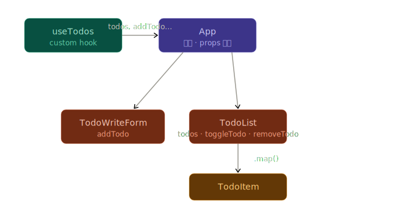

# ✅ React Todo App



<br/>

## 📌 프로젝트 소개

React의 핵심 개념인 **컴포넌트 분리**, **Custom Hook**, **상태 관리(useState/useRef)** 를 직접 구현해보는 Todo 앱입니다.  
할 일 추가 / 완료 토글 / 삭제 기능을 갖추고 있으며, 관심사 분리 원칙에 따라 로직과 UI를 구분하여 작성했습니다.

<br/>

## 🛠 기술 스택

| 구분       | 사용 기술                      |
| ---------- | ------------------------------ |
| 프레임워크 | React 18                       |
| 빌드 도구  | Vite                           |
| 언어       | JavaScript (JSX)               |
| 상태 관리  | useState, useRef (Custom Hook) |

<br/>

## ⚙️ 구현 기능

- ✅ 할 일 **추가** — 입력 후 등록 버튼 또는 Enter 키
- ✅ 할 일 **완료 토글** — 체크박스 클릭으로 완료/미완료 전환
- ✅ 할 일 **삭제** — 항목별 삭제 버튼
- ✅ 빈 입력 **유효성 검사** — 공백 입력 시 경고 알림
- ✅ 최신 항목이 **목록 상단**에 표시

<br/>

## 🗂 컴포넌트 구조

```
src/
├── App.jsx                  # 루트 컴포넌트 — 상태·핸들러 배분
├── hooks/
│   └── useTodos.js          # Custom Hook — 상태 및 비즈니스 로직
└── components/
    ├── TodoWriteForm.jsx     # 할 일 입력 폼
    ├── TodoList.jsx          # 할 일 목록 렌더링
    └── TodoItem.jsx          # 개별 할 일 아이템
```

### 데이터 흐름

```
useTodos (Custom Hook)
    ↓ todos, addTodo, toggleTodo, removeTodo
  App.jsx
    ├─→ TodoWriteForm  (addTodo)
    └─→ TodoList       (todos, toggleTodo, removeTodo)
              └─→ TodoItem × N
```

| 컴포넌트        | 역할                                           |
| --------------- | ---------------------------------------------- |
| `useTodos`      | `todos` 상태 및 CRUD 로직 관리                 |
| `App`           | Hook에서 받은 상태·함수를 하위 컴포넌트에 전달 |
| `TodoWriteForm` | 폼 제출 이벤트 처리 및 `addTodo` 호출          |
| `TodoList`      | 배열을 순회하며 `TodoItem` 렌더링              |
| `TodoItem`      | 체크박스·삭제 버튼 UI 및 이벤트 처리           |

<br/>

## 🚀 실행 방법

```bash
# 패키지 설치
npm install

# 개발 서버 실행
npm run dev
```
